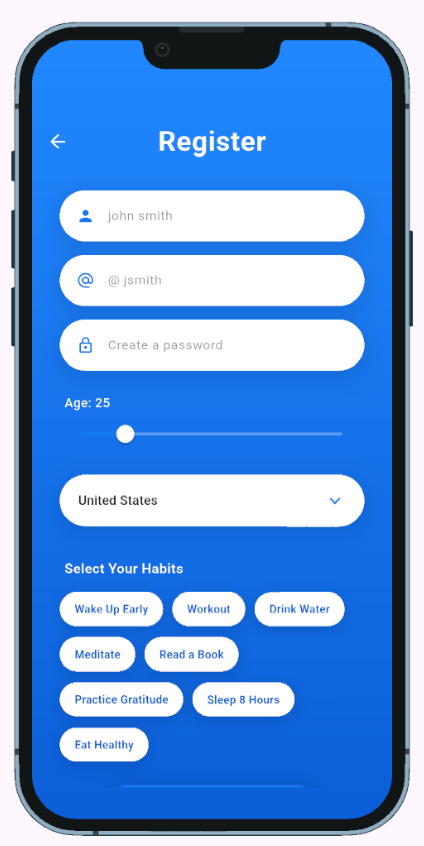
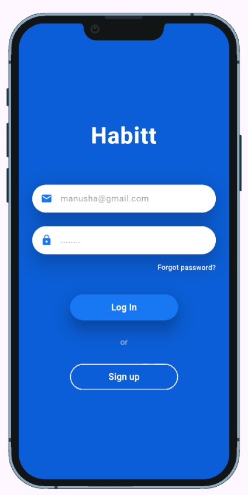
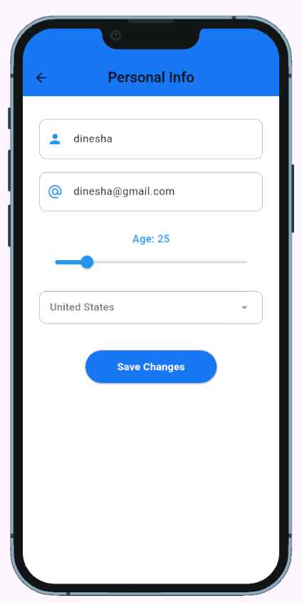
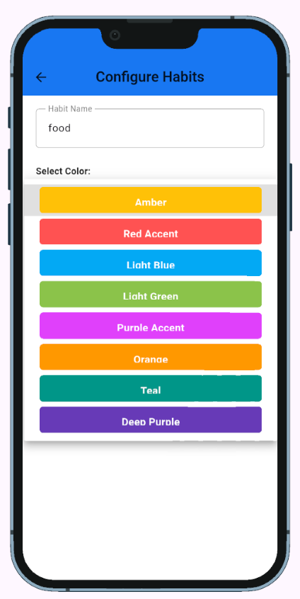
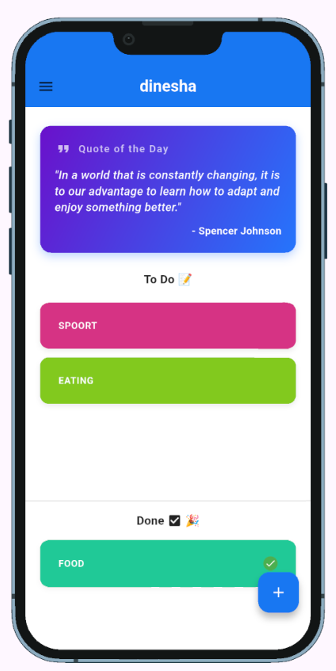
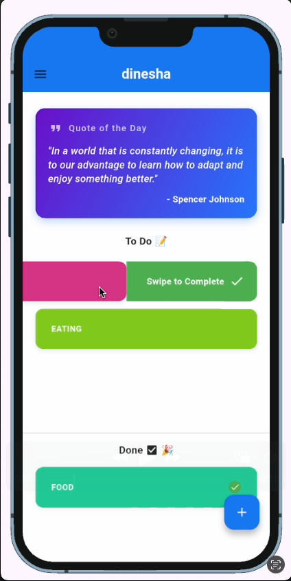
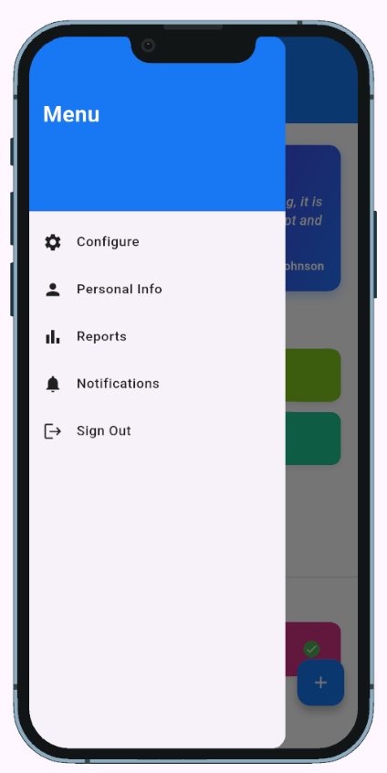
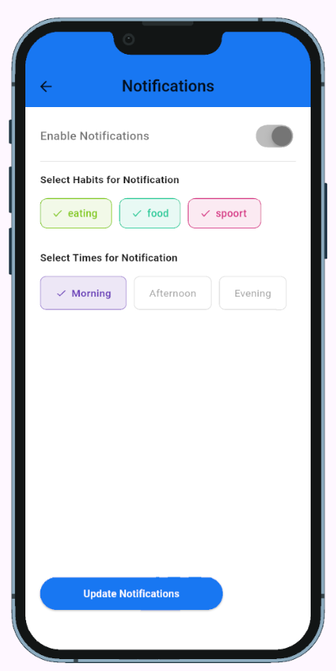
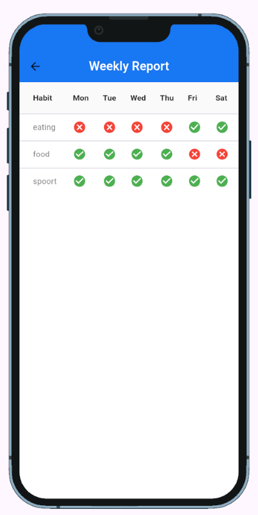

# Habit Tracker App

A feature-rich, beautifully designed Habit Tracker mobile application built with Flutter. This app helps users build and maintain positive daily habits with features like user authentication, local data persistence, daily scheduled push notifications, and a motivational quote of the day fetched via an external API.

## Screenshots

| User Registration | User Login | Profile Setup |
| :---: | :---: | :---: |
|  |  |  |

| Add Habit | Dashboard (API) | Habit Interaction |
| :---: | :---: | :---: |
|  |  |  |

| Navigation Drawer | Push Notifications | Progress Chart |
| :---: | :---: | :---: |
|  |  |  |

## Demo

<video src="https://github.com/user-attachments/assets/d6177a51-0c6a-42a5-821d-b084b497e733" controls width="600"></video>

## Features

1. **User Authentication (Sign Up):** Create a personal account securely.
2. **User Authentication (Log In):** Log in securely to access your personal dashboard.
3. **Profile Setup:** Set up a personalized profile with your name, age, and country.
4. **Habit Configuration:** Create custom habits and assign distinct colors for easy tracking.
5. **Dashboard View:** View your daily to-do list at a glance on the main dashboard.
6. **Habit Tracking:** Swipe gestures to mark habits as completed and track daily progress.
7. **Data Persistence:** Habits and configurations are saved locally on your device.
8. **Scheduled Notifications:** Receive daily push notifications at preferred times (Morning/Afternoon/Evening) as reminders.
9. **External API (Motivational Quote):** Stay inspired with a motivational quote of the day fetched automatically.

## Architecture & Security

This project strictly adheres to professional software engineering patterns:

*   **Clean Architecture:** The application separates concerns meticulously into `models`, `providers`, `repositories`, `screens`, and `services`.
*   **Provider Pattern:** Reactive and scalable state management is handled using `ChangeNotifierProvider` and `Consumer` widgets.
*   **Repository Pattern:** `SharedPreferences` is entirely abstracted behind repository classes, keeping the business logic agnostic of the storage mechanism.
*   **SHA-256 Hashing:** User passwords are securely hashed using cryptographic SHA-256 algorithms before storage; plain-text passwords are never saved.

## Tech Stack

*   **Framework:** [Flutter](https://flutter.dev/)
*   **Language:** [Dart](https://dart.dev/)
*   **State Management:** `provider`
*   **Local Storage:** `shared_preferences`
*   **Background Tasks/Alerts:** `flutter_local_notifications`, `timezone`
*   **Security:** `crypto` (SHA-256)
*   **Networking:** `http`

## Getting Started

To run this project locally, ensure you have Flutter installed on your machine.

1. **Clone the repository:**
   ```bash
   git clone https://github.com/yourusername/habit-tracker-app.git
   cd habit-tracker-app/habit_app
   ```

2. **Install dependencies:**
   ```bash
   flutter pub get
   ```

3. **Run the app:**
   ```bash
   flutter run
   ```
